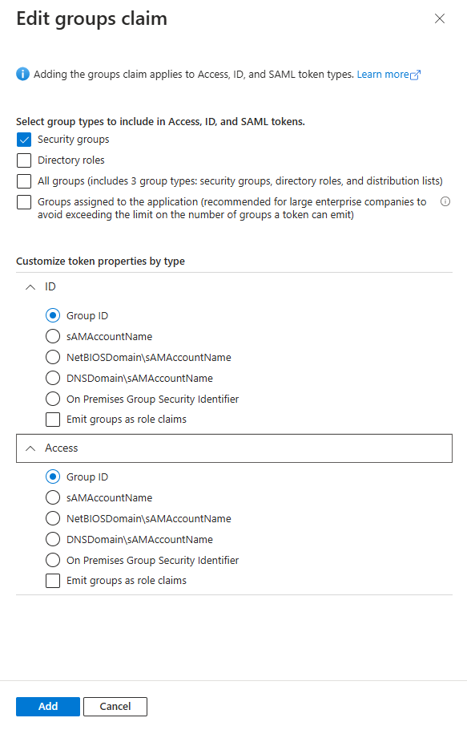

# Main Changes


## Program.cs
```c#
   builder.Services.AddAuthentication(OpenIdConnectDefaults.AuthenticationScheme)
        .AddMicrosoftIdentityWebApp(options =>
        {
            builder.Configuration.Bind("AzureAd", options);
            options.TokenValidationParameters.RoleClaimType = "groups"; 
        });

   builder.Services.AddAuthorization(options =>
   {
       options.AddPolicy(Roles.HQUsers, policy => policy.RequireRole(Roles.HQUsers));
       // By default, all incoming requests will be authorized according to the default policy.
       options.FallbackPolicy = options.DefaultPolicy;
   });
```
# Roles.cs

```c#
public static class Roles
{
    public const string HQUsers = "396f4717-c69b-41d6-a082-6954266300000"; // ObjectID, not SID
}
```
# Protect Endpoints
```c#
[Authorize (Policy = Roles.HQUsers)]
public class IndexModel1 : PageModel
{
    private readonly ILogger<IndexModel> _logger;

    public IndexModel1(ILogger<IndexModel> logger)
    {
        _logger = logger;
    }

    public void OnGet()
    {
        // For debugging: check user claims
        var claims = User.Claims.Select(c => new { c.Type, c.Value }).ToList();
        // You can set a breakpoint here to inspect claims
    }
}
```

# Steps to Expose Group ObjectID in the Claims Token

In the Azure portal:

* Navigate to Azure Active Directory > App registrations > Your App > Token configuration.
* Click on "Add groups claim".
* Select "Security groups" and ensure "Group ID" is selected under both "ID Token" and "Access Token".
* Click "Add".

